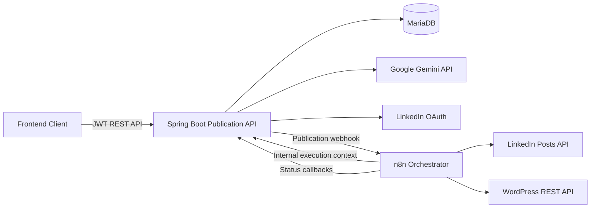

# Publication API

Backend service for a content publication platform that combines **human validation**, **AI-assisted writing**, **scheduled publication**, and **multi-channel delivery** to **LinkedIn** and **WordPress**.

The application is built with **Spring Boot**, orchestrates external publication workflows through **n8n**, uses **Google Gemini via Spring AI** for content assistance, and secures user and third-party credentials with JWT authentication and encrypted storage.

> This repository contains the backend API and the versioned n8n publication workflow.

---

## Overview

Publication API centralizes the lifecycle of professional content:

```text
Create / Generate content
        ↓
      DRAFT
        ↓
 Human review & editing
        ↓
      READY
        ↓
 Immediate or scheduled publication
        ↓
       n8n
      ↙   ↘
LinkedIn  WordPress
        ↓
 PUBLISHED / FAILED
```

AI-generated content is **never published automatically**. Every generated or improved draft remains subject to human review before it can enter the publication workflow.

---

## Main Features

- JWT-based registration and authentication
- User-scoped content management
- Explicit content lifecycle: `DRAFT → READY → ARCHIVED`
- Human validation before publication
- Immediate and scheduled publishing
- Multi-destination publication to LinkedIn and WordPress
- LinkedIn OAuth 2.0 account connection
- Secure WordPress Application Password integration
- Encrypted storage of third-party credentials
- n8n asynchronous orchestration with retries and callbacks
- Publication state tracking and external post IDs
- Cancellation of pending or scheduled publications
- Google Gemini content generation and improvement through Spring AI
- Third-party account status and disconnect management
- OpenAPI 3 / Swagger UI documentation
- Centralized API error handling and server-side error logging
- Automated unit and integration tests with an isolated H2 test database

---

## Technology Stack

| Layer | Technology |
| --- | --- |
| Language | Java 17 |
| Backend | Spring Boot 4.1.1 |
| Web | Spring MVC / REST |
| Security | Spring Security, JWT |
| Persistence | Spring Data JPA / Hibernate |
| Production database | MariaDB |
| Test database | H2 |
| AI integration | Spring AI 2.0.1 |
| AI provider | Google Gemini |
| Workflow orchestration | n8n |
| LinkedIn integration | OAuth 2.0 + LinkedIn REST API |
| WordPress integration | WordPress REST API + Application Password |
| API documentation | springdoc-openapi / Swagger UI |
| Build | Maven Wrapper |
| Credential encryption | AES-256-GCM |

---

## Architecture



### Backend responsibilities

Spring Boot owns:

- authentication and authorization
- business rules
- content lifecycle
- publication lifecycle
- persistence
- account connection metadata
- encryption/decryption of third-party credentials
- LinkedIn OAuth
- AI content assistance
- audit information
- n8n execution context and callback validation

### n8n responsibilities

n8n owns:

- asynchronous execution
- waiting until a scheduled publication time
- routing by destination
- external HTTP calls
- retry behavior
- final publication callbacks

The versioned workflow is stored in:

```text
n8n/Publication_Orchestrator.json
```

---

## Domain Lifecycle

### Content

```text
DRAFT ──ready──▶ READY
  ▲                │
  │                │ edit
  └────────────────┘

DRAFT / READY ──archive──▶ ARCHIVED
```

Editing a `READY` content returns it to `DRAFT`, requiring human validation again before publication.

### Publication

```text
PENDING / SCHEDULED
        ↓
    PROCESSING
      ↙     ↘
PUBLISHED   FAILED
```

`PUBLISHED`, `FAILED`, and `CANCELLED` are terminal states.

A publication may be cancelled while it is still `PENDING` or `SCHEDULED`.

---

## Security Model

The API applies several security controls:

- JWT authentication for protected application endpoints
- BCrypt password hashing
- stateless Spring Security configuration
- AES-256-GCM encryption for third-party credentials at rest
- LinkedIn access tokens stored encrypted
- WordPress Application Passwords stored encrypted
- separate JWT and encryption keys
- n8n internal endpoints protected with `X-N8N-SECRET`
- constant-time shared-secret comparison
- internal n8n endpoints hidden from Swagger
- external provider secrets loaded from environment variables
- `.env` excluded from Git
- generic client-facing responses for unexpected server errors

Never commit real API keys, OAuth client secrets, access tokens, passwords, JWT secrets, encryption keys, or n8n shared secrets.

---

## Prerequisites

Install or configure:

- Java 17
- Git
- MariaDB
- Docker, if n8n is run as a container
- a Google AI Studio / Gemini API key
- a LinkedIn Developer application
- a WordPress site with REST API access and an Application Password
- Maven is optional because the repository includes `./mvnw`

---

## Configuration

### 1. Clone the repository

```bash
git clone https://github.com/thelazygenius404/publication-api.git
cd publication-api
```

### 2. Create the database

Example:

```sql
CREATE DATABASE publication_db
    CHARACTER SET utf8mb4
    COLLATE utf8mb4_unicode_ci;
```

Create or use a MariaDB user that has access to this database.

### 3. Create the environment file

```bash
cp .env.example .env
```

Configure `.env`:

```env
DB_URL=jdbc:mariadb://localhost:3306/publication_db
DB_USERNAME=
DB_PASSWORD=

JWT_SECRET=
APP_ENCRYPTION_KEY=

FRONTEND_ORIGINS=http://localhost:5173,http://localhost:4173

SPRING_PROFILES_ACTIVE=dev
DEV_ADMIN_EMAIL=
DEV_ADMIN_PASSWORD=

N8N_WEBHOOK_URL=http://localhost:5678/webhook/publications
N8N_SHARED_SECRET=replace-with-a-long-random-secret

APP_PUBLIC_URL=http://localhost:8080

LINKEDIN_CLIENT_ID=
LINKEDIN_CLIENT_SECRET=
LINKEDIN_REDIRECT_URI=http://localhost:8080/api/accounts/linkedin/callback
LINKEDIN_API_VERSION=202608

GEMINI_API_KEY=
GEMINI_MODEL=gemini-2.5-flash
GEMINI_TEMPERATURE=0.5
```

### 4. Generate secure application keys

Generate a 256-bit JWT secret:

```bash
openssl rand -base64 32
```

Generate a separate 256-bit encryption key:

```bash
openssl rand -base64 32
```

Use different values for `JWT_SECRET` and `APP_ENCRYPTION_KEY`.

---

## LinkedIn Configuration

Create a LinkedIn Developer application and configure the OAuth callback:

```text
http://localhost:8080/api/accounts/linkedin/callback
```

The application uses the following scopes:

```text
openid
profile
w_member_social
```

Relevant environment variables:

```env
LINKEDIN_CLIENT_ID=
LINKEDIN_CLIENT_SECRET=
LINKEDIN_REDIRECT_URI=http://localhost:8080/api/accounts/linkedin/callback
LINKEDIN_API_VERSION=202608
```

The backend:

1. creates a short-lived encrypted OAuth `state`
2. exchanges the authorization code for an access token
3. obtains the LinkedIn member identifier
4. encrypts the token before persistence
5. tracks token expiry
6. exposes only the execution data required by n8n

If the token expires, the account is marked `EXPIRED` and the user must reconnect LinkedIn.

---

## WordPress Configuration

WordPress publishing uses a WordPress **Application Password**, not the user's normal password.

The authenticated user connects WordPress through the API by providing:

- site URL
- WordPress username
- Application Password

The backend normalizes the site URL, encrypts the credentials, and stores them for n8n execution.

If WordPress runs on the host machine while n8n runs in Docker, use a site URL reachable from the container, for example:

```text
http://host.docker.internal:8081
```

---

## Gemini / Spring AI

Content assistance is provided through Google Gemini using Spring AI.

Configured defaults:

```env
GEMINI_MODEL=gemini-2.5-flash
GEMINI_TEMPERATURE=0.5
```

Available AI operations:

```text
POST /api/ai/generate
POST /api/ai/improve
```

Example generation request:

```json
{
  "topic": "Les avantages de l'automatisation des publications",
  "tone": "professionnel",
  "language": "français"
}
```

Example response:

```json
{
  "title": "Generated title",
  "body": "Generated publication content..."
}
```

AI output is returned to the client and does not bypass the normal `DRAFT → READY` human-validation flow.

---

## n8n Setup

The workflow file is versioned at:

```text
n8n/Publication_Orchestrator.json
```

### Run n8n with Docker

Load the environment variables first:

```bash
set -a
source .env
set +a
```

Then run n8n:

```bash
docker run -d \
  --name n8n \
  --restart unless-stopped \
  -p 5678:5678 \
  --add-host=host.docker.internal:host-gateway \
  -e N8N_SHARED_SECRET="${N8N_SHARED_SECRET}" \
  -v n8n_data:/home/node/.n8n \
  docker.n8n.io/n8nio/n8n
```

Open n8n:

```text
http://localhost:5678
```

Import:

```text
n8n/Publication_Orchestrator.json
```

Configure the n8n Header Auth credential so that the workflow sends:

```text
X-N8N-SECRET: <same value as N8N_SHARED_SECRET>
```

When n8n runs in Docker, the backend must be reachable from the container. A typical local configuration is:

```env
N8N_WEBHOOK_URL=http://localhost:5678/webhook/publications
APP_PUBLIC_URL=http://host.docker.internal:8080
```

The first address is used by Spring Boot to call n8n.  
The second is used by n8n to call Spring Boot.

---

## Running the Application

Load environment variables:

```bash
set -a
source .env
set +a
```

Start Spring Boot:

```bash
./mvnw spring-boot:run
```

Default backend URL:

```text
http://localhost:8080
```

---

## API Documentation

Swagger UI:

```text
http://localhost:8080/swagger-ui.html
```

OpenAPI JSON:

```text
http://localhost:8080/v3/api-docs
```

OpenAPI YAML:

```text
http://localhost:8080/v3/api-docs.yaml
```

Most application endpoints require JWT authentication.

In Swagger UI:

1. call `POST /auth/login`
2. copy the returned JWT
3. click **Authorize**
4. enter the token
5. execute protected endpoints

Internal n8n endpoints are intentionally excluded from the public Swagger specification.

---

## API Overview

| Method | Endpoint | Description | Authentication |
| --- | --- | --- | --- |
| POST | `/auth/register` | Register a user | Public |
| POST | `/auth/login` | Authenticate and obtain JWT | Public |
| GET | `/api/contents` | List user contents | JWT |
| POST | `/api/contents` | Create content | JWT |
| GET | `/api/contents/{id}` | Get content | JWT |
| PUT | `/api/contents/{id}` | Edit content | JWT |
| POST | `/api/contents/{id}/ready` | Validate content for publication | JWT |
| DELETE | `/api/contents/{id}` | Delete/archive content | JWT |
| GET | `/api/publications` | List publications | JWT |
| POST | `/api/publications` | Create immediate/scheduled publications | JWT |
| GET | `/api/publications/{id}` | Get publication status | JWT |
| POST | `/api/publications/{id}/cancel` | Cancel pending/scheduled publication | JWT |
| GET | `/api/accounts` | Get safe third-party account status | JWT |
| POST | `/api/accounts/wordpress` | Connect WordPress | JWT |
| DELETE | `/api/accounts/wordpress` | Disconnect WordPress | JWT |
| GET | `/api/accounts/linkedin/authorization-url` | Start LinkedIn OAuth | JWT |
| GET | `/api/accounts/linkedin/callback` | LinkedIn OAuth callback | Public OAuth callback |
| DELETE | `/api/accounts/linkedin` | Disconnect LinkedIn | JWT |
| POST | `/api/ai/generate` | Generate a publication draft with Gemini | JWT |
| POST | `/api/ai/improve` | Improve existing content with Gemini | JWT |

---

## Example Authentication Flow

Register:

```bash
curl -X POST http://localhost:8080/auth/register \
  -H 'Content-Type: application/json' \
  -d '{
    "email": "user@example.com",
    "password": "StrongPassword123!"
  }'
```

Login:

```bash
curl -X POST http://localhost:8080/auth/login \
  -H 'Content-Type: application/json' \
  -d '{
    "email": "user@example.com",
    "password": "StrongPassword123!"
  }'
```

Store the JWT:

```bash
TOKEN=$(
  curl -s \
    -X POST http://localhost:8080/auth/login \
    -H 'Content-Type: application/json' \
    -d '{
      "email": "user@example.com",
      "password": "StrongPassword123!"
    }' |
  jq -r '.access_token'
)
```

Use it:

```bash
curl -s \
  http://localhost:8080/api/contents \
  -H "Authorization: Bearer $TOKEN" |
jq
```

---

## Testing

The test suite uses an isolated in-memory H2 database and safe test-only configuration.

Run all tests:

```bash
./mvnw clean test
```

Current verified result:

```text
Tests run: 43
Failures: 0
Errors: 0
Skipped: 0
BUILD SUCCESS
```

The tests cover core areas including:

- authentication
- content lifecycle
- publication lifecycle
- n8n callback transitions and idempotency
- n8n execution context generation
- LinkedIn OAuth state validation
- third-party account status and expiry
- Gemini content service behavior

External services are mocked or isolated where appropriate during regular automated tests.

---

## Project Structure

```text
publication-api/
├── .env.example
├── n8n/
│   └── Publication_Orchestrator.json
├── src/
│   ├── main/
│   │   ├── java/com/smaservices/publication_api/
│   │   │   ├── config/
│   │   │   ├── controller/
│   │   │   ├── dto/
│   │   │   ├── entity/
│   │   │   ├── exception/
│   │   │   ├── repository/
│   │   │   ├── security/
│   │   │   └── service/
│   │   └── resources/
│   │       └── application.properties
│   └── test/
├── pom.xml
├── mvnw
└── mvnw.cmd
```

---

## Publication Workflow

For each destination, the backend creates an independent publication record.

Immediate publication:

```text
READY content
    ↓
POST /api/publications
    ↓
PENDING
    ↓
after-commit n8n dispatch
    ↓
PROCESSING
    ↓
LinkedIn / WordPress
    ↓
PUBLISHED or FAILED
```

Scheduled publication:

```text
READY content
    ↓
POST /api/publications + scheduledAt
    ↓
SCHEDULED
    ↓
n8n Wait
    ↓
PROCESSING
    ↓
PUBLISHED or FAILED
```

The n8n workflow retries external HTTP calls and sends final status information back to Spring Boot.

---

## Development Notes

### Local n8n networking

When n8n runs in Docker and Spring Boot runs on the host:

```text
Spring Boot → n8n:
http://localhost:5678

n8n → Spring Boot:
http://host.docker.internal:8080
```

### Credential handling

Do not print or expose:

```text
Authorization headers
LinkedIn access tokens
LinkedIn client secrets
WordPress Application Passwords
N8N_SHARED_SECRET
JWT_SECRET
APP_ENCRYPTION_KEY
GEMINI_API_KEY
```

Rotate any credential that is accidentally exposed in logs, screenshots, terminal history, or Git history.

---

## Current Backend Status

```text
Authentication                 COMPLETE
Content lifecycle              COMPLETE
Human validation               COMPLETE
Immediate publication          COMPLETE
Scheduled publication          COMPLETE
Publication cancellation       COMPLETE
WordPress integration          COMPLETE
LinkedIn OAuth                 COMPLETE
LinkedIn publishing            COMPLETE
n8n orchestration              COMPLETE
Encrypted credentials          COMPLETE
Third-party account management COMPLETE
Gemini / Spring AI             COMPLETE
Swagger / OpenAPI              COMPLETE
Automated tests                43 passing
```

The next application layer is the frontend client consuming this API.

---

## Repository

Backend repository:

https://github.com/thelazygenius404/publication-api

---

## License

No open-source license has been specified for this repository yet.
